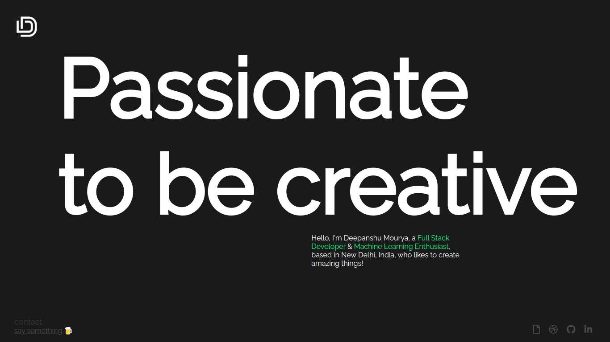

  

<h1 align="center">
  Portfolio Website v1
</h1>

  First iteration of <a href="https://thedeepanshumourya.github.io/" target="_blank">thedeepanshumourya.github.io</a> built with <a href="https://greensock.com/gsap/" target="_blank">GSAP</a> and hosted with <a href="https://pages.github.com/" target="_blank">Github Pages</a>

  Next iteration:
  <a href="https://deepanshumourya.now.sh/" target="_blank">v2</a>

